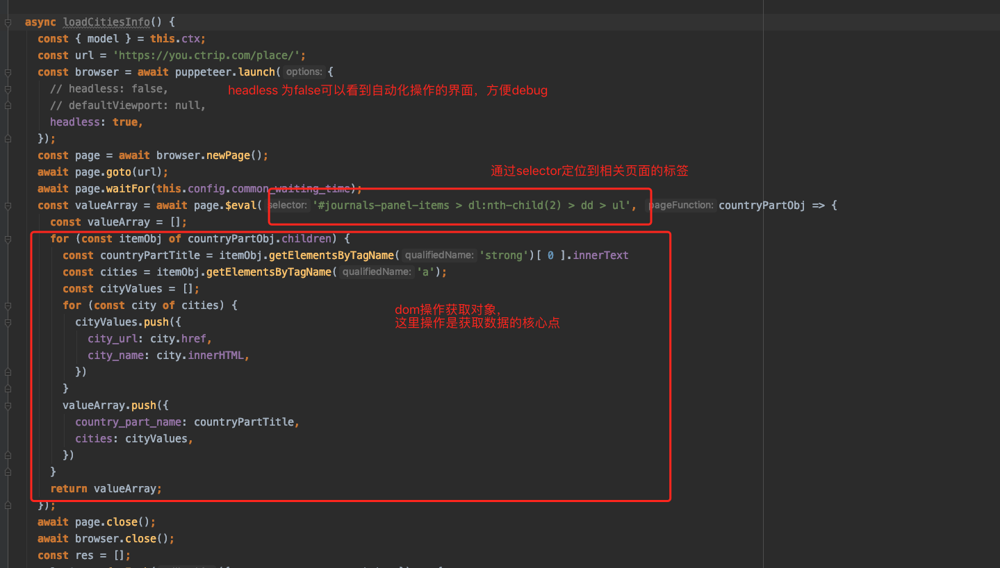
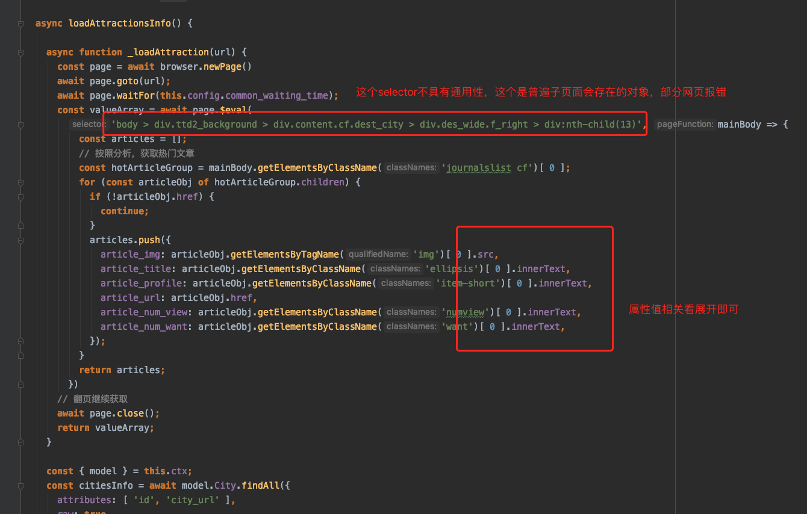
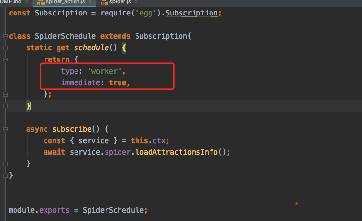

# egg-puppeteer-schedule-demo

最近收到一个小需求，要求爬一下携程或者其他网站旅游相关的文章、景点数据，最近需求堆积的不是很厉害，因此在心（wei）甘（bi）情（li）愿（you）下用node写个项目爬爬数据，本文章用作记录。

egg是最近公司项目一直使用的框架，为了闲着没事同时也为了看看能否做出一个满足其他产品需求的插件，因为本项目使用egg+puppeteer去实现，ORM就用sequelize吧（ps：这货真的是让我又爱又恨，爱是因为操作上手后着实比较舒服，恨...有的时候为了符合它的语法，一个简单的sql语句我得绕了好几圈hasMany、belongTo去实现，有的时候还不一定能实现出来，只能绕道）扯远了，继续说正文。
先安装相关依赖包吧

egg-sequelize [knock me](https://github.com/eggjs/egg-sequelize)

```bash
npm i --save egg-sequelize
npm i --save mysql2
```

puppeteer [knock me](https://www.npmjs.com/package/puppeteer)


```bash
npm i --save puppeteer
```

形成相关项目结构，探索目标网站，目前需要存储结构如下：旅游地点、原网页地址、简图、50字内简要、评分等，相关库表就先这样简单来吧，打开dg，建表完毕(数据库什么的从简来吧orz...)

ok打开网站，要是有一个一口气哪里都按照数据格式排列好的自然最爽，看了看这个目标地址，还好。接下来的工作主要分为三步走

| step | content |
| ------ | ------ |
| step1 | 分析后获取网站目标地址城市名称、跳转地址等信息源 |
| step2 | 通过跳转地址DOM分析景点数据源 |
| step3 | 盘它 |

#step1:获取目的地相关信息

拿到网站发现做的听高大上，万变不离其宗，总得有数据源吧，万能f12(option+command+i)dom找一找，于是，如图

简单的来说就是通过selector获取到对应的ul标签，然后通过层级解析出来数据名称和href值，整理好了存库即可。所以，走你


#step2:获取游记相关信息
通过上述步骤可知，每个城市都有一个独立href的页面，通过观察的几个页面，整体的布局还是一致的，于是我们假设所有页面具有一样的布局，所以，我们可以获取游记标签的selector值了，下面就简单了，解析、获取对应值。

#step3:盘它！

###coding1:获取目的地相关信息
目前需要驱动puppeteer做一次定向网站访问 => 访问后获取数据源，解开dom拿到相关数据 => 存库
具体可参考 service.spider.loadCitiesInfo


###coding2:获取游记信息
按照前页的目的地信息遍历目标对象，每一个对象为一个page，分析了下dom相关，找到需要的数据解析 => 存库


###coding3:运行方式
整体代码为了运行方便（也是考虑下以后的使用点），逻辑驱动使用了定时任务，当项目启动后，schedule/spider_action.js 文件的immediate属性会趋势定时任务启动，任务启动在worker线程上，也减少一点进程开销
egg整体框架的强约束对开发也是很有帮助的，



#写在最后
代码分析的不是很到位，puppeteer的使用也只是轻描淡写，因为需求排期相当紧张。egg框架给我的感觉就是方便我从已知的java系列对比过来，强约束的风格制式我能减少一点对环境的顾虑，这里为什么写成一个schedule而不是写成一个
application就算了呢，这也是框架的一个优点之处，因为业务需求凸显的不是很重，作为开发个人意愿是想沉淀成一个插件去运作。

如有问题随时联系我。
yeruyi_roy@outlook.com


